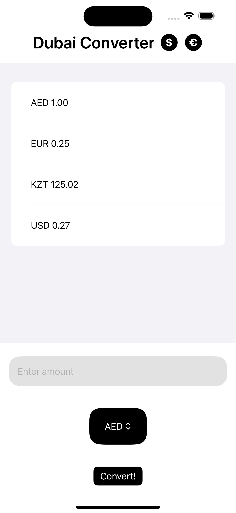

# Dubai Currency Converter

  

## Overview

Currency Converter is a simple iOS application that allows you to convert between four different currencies: AED (United Arab Emirates Dirham), EUR (Euro), KZT (Kazakhstani Tenge), and USD (United States Dollar). This application was inspired by my move to Dubai and aims to provide a quick and convenient way to get the current exchange rates for these selected currencies.

## Features

- Real-time currency conversion
- Supports four currencies: AED, EUR, KZT, USD
- Simple and intuitive UI
- Offline support using the most recently fetched rates

## Technologies used

- Swift
- SwiftUI

## API Reference

The application uses a third-party API to get the latest currency rates. More details can be found [here](https://exchangerate.host/#/).

## License

This project is licensed under the MIT License - see the [LICENSE](./LICENSE) for details.